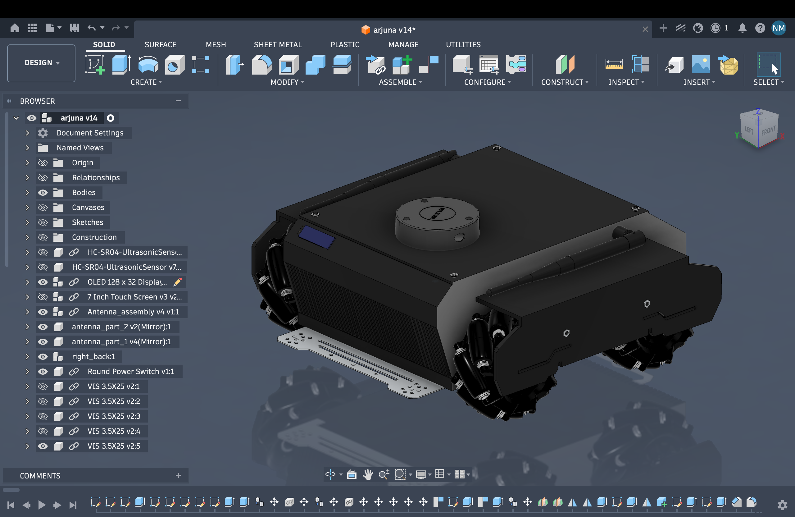
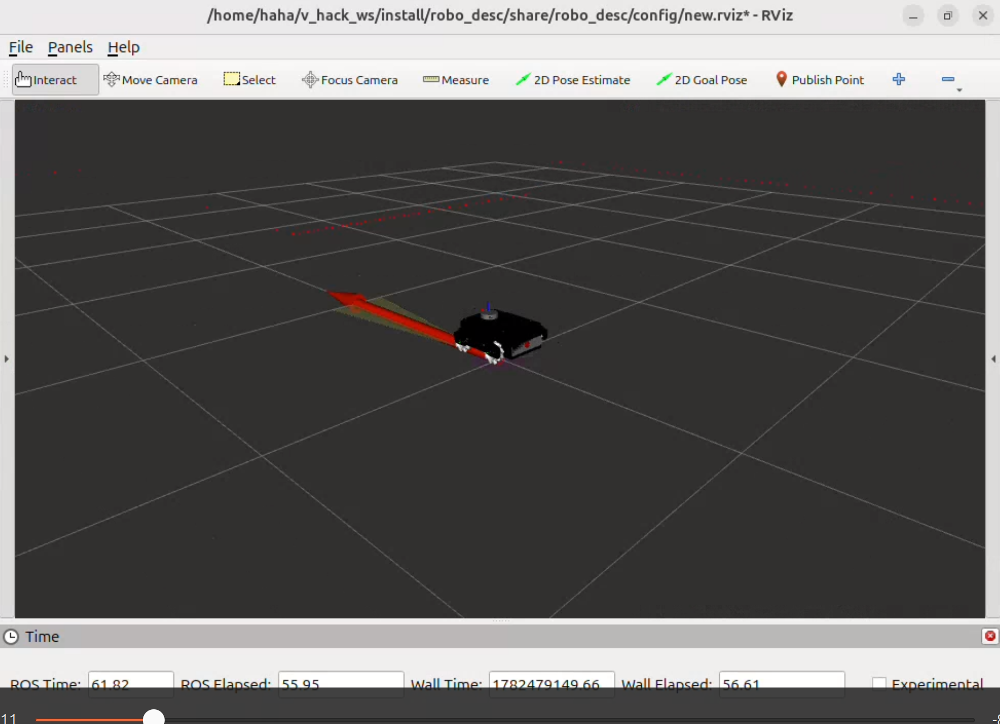
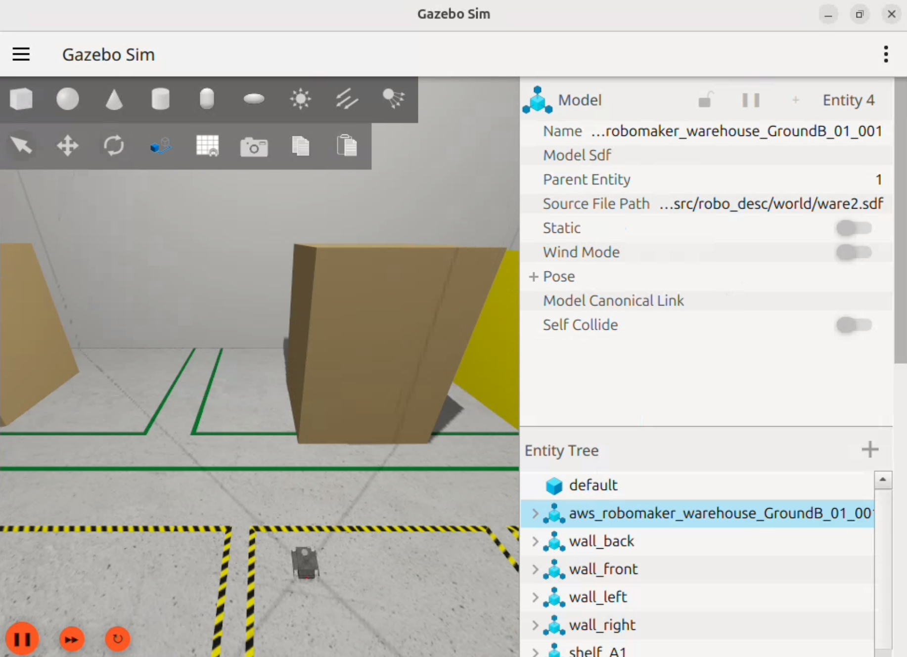
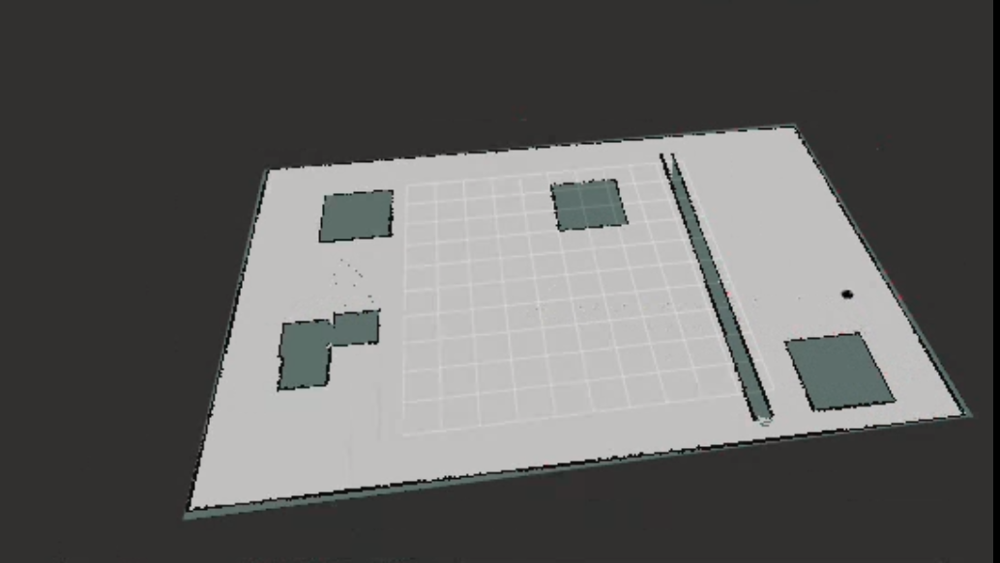
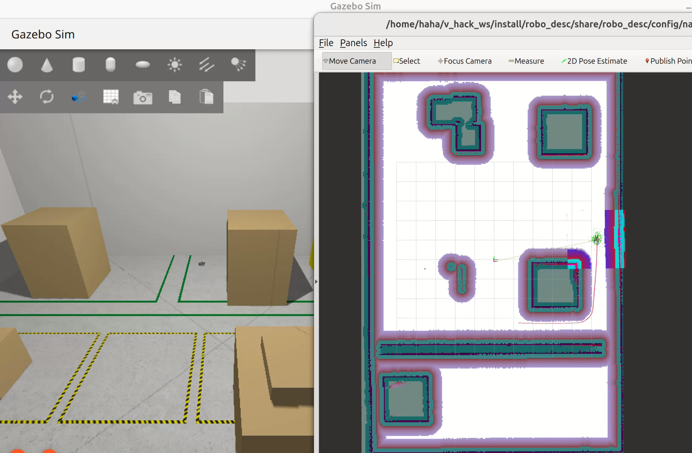

<div align="center">

# Mecanum Nav Robot

**An omnidirectional mobile robot that maps and navigates its environment autonomously — built on ROS2, simulated in Gazebo.**


</div>

<p align="center">
Differential-drive robots can only move forward, backward, and turn in place. This robot uses a
<b>four-wheel mecanum drive</b> instead — it can move forward, strafe sideways, and rotate independently,
all without changing its heading — then maps and navigates its environment autonomously with SLAM and Nav2.
</p>

---

## Contents

- [Overview](#overview)
- [Design and URDF](#design-and-urdf)
- [Simulation results](#simulation-results)
- [Tech stack](#tech-stack)
- [Project structure](#project-structure)
- [How it works](#how-it-works)
- [Autonomous navigation](#autonomous-navigation)
- [Getting started](#getting-started)
- [Demo videos](#demo-videos)
- [Author](#author)
- [License](#license)

---

## Overview

This repo covers the full pipeline for a mecanum-wheel navigation robot, from CAD to autonomous patrol:

- **Custom robot design** modeled in Fusion 360 and converted to URDF/Xacro
- **Gazebo Harmonic simulation** with a physically accurate wheel, LiDAR, and IMU setup
- **Custom mecanum odometry node** that works around a real simulation limitation in Gazebo's default odometry plugin
- **SLAM Toolbox mapping** to build a 2D occupancy grid of any environment
- **Nav2 navigation stack** for autonomous, collision-free path planning
- **Autonomous patrol behavior** that drives the robot along a route without manual control

---

## Design and URDF

<table>
<tr>
<td align="center" width="50%">

**Fusion 360 design**



</td>
<td align="center" width="50%">

**URDF in RViz**



</td>
</tr>
</table>

The chassis was modeled in **Autodesk Fusion 360**. The design is inspired by **Arjuna**, a robot from the robotics startup **NEWRRO**, adapted here into a four-wheel mecanum platform.

The Fusion 360 model was converted into a **URDF/Xacro** description, defining every link, joint, wheel, LiDAR mount, and IMU mount so the robot simulates accurately in Gazebo and visualizes correctly in RViz2.

---

## Simulation results

<table>
<tr>
<td align="center" width="50%">

**Gazebo simulation**



</td>
<td align="center" width="50%">

**Generated map**



</td>
</tr>
</table>

The robot runs inside **Gazebo Harmonic** while **SLAM Toolbox** generates a real-time occupancy grid map, ready to be handed off to Nav2 for autonomous navigation.

---

## Tech stack

| Layer              | Technology                                      |
| ------------------ | ------------------------------------------------ |
| Robot framework     | ROS2 Jazzy                                       |
| Simulation          | Gazebo Harmonic (`gz sim`)                       |
| Robot description   | URDF / Xacro                                     |
| Drive type          | Four-wheel mecanum, omnidirectional              |
| Sensing             | Simulated LiDAR + IMU                            |
| Odometry            | Custom mecanum forward-kinematics node (Python)  |
| Mapping             | SLAM Toolbox                                     |
| Navigation          | Nav2                                             |
| Visualization       | RViz2                                            |
| 3D design           | Autodesk Fusion 360                              |
| ROS↔Sim bridge      | `ros_gz_bridge`                                  |

---

## Project structure

Four ROS2 packages, each with a single responsibility:

```text
mecanum-nav-robot/
├── design/                          # Fusion 360 design exports/renders
├── docs/                            # Reference docs
├── media/                           # Screenshots and demo videos
├── src/
│   ├── robo_desc/                   # Robot description + Gazebo simulation
│   │   ├── urdf/robot.xacro         # Robot description (URDF/Xacro)
│   │   ├── launch/gazebo.launch.py  # Main simulation launch
│   │   ├── launch/display.launch.py # RViz-only launch (URDF, no sim)
│   │   ├── world/nav_world.sdf      # Simulation world (SDF)
│   │   └── meshes/                  # Custom STL meshes (wheels, body, LiDAR)
│   │
│   ├── mecanum_odom/                # Custom odometry package
│   │   └── mecanum_odom/odom_node.py
│   │
│   ├── robo_bringup/                # SLAM + Nav2 bringup package
│   │   ├── config/mapper_params_online_async.yaml   # SLAM Toolbox params
│   │   ├── config/nav2_params.yaml                  # Nav2 stack params
│   │   ├── launch/slam.launch.py                    # Sim + online SLAM mapping
│   │   ├── launch/navigation.launch.py               # Sim + Nav2 navigation
│   │   ├── launch/auto_patrol_nav.launch.py          # Navigation + autonomous patrol
│   │   └── maps/my_map.pgm, my_map.yaml              # Saved occupancy grid map
│   │
│   └── auto_patrol/                 # Autonomous patrol behavior package
│       └── auto_patrol/patrol.py    # Sends the robot on a patrol route via Nav2
│
└── README.md
```

---

## How it works

### Custom mecanum odometry

The robot uses **four mecanum wheels** — angled-roller wheels that let it move in any direction (forward, sideways, diagonal) without rotating the body.

Gazebo's built-in odometry plugin relies on wheel collision geometry to compute motion. This robot's mecanum wheels use a **sphere as the collision primitive** — a common simplification for the angled-roller contact point — which makes Gazebo's default odometry inaccurate for this drive type.

To fix that, `odom_node.py` bypasses Gazebo's plugin entirely and computes odometry directly from **joint states**, using mecanum forward kinematics:

```text
vx = r/4 * ( w_lf + w_rf + w_lb + w_rb )            ← forward / backward
vy = r/4 * (-w_lf + w_rf + w_lb - w_rb )            ← left / right strafe
wz = r / (4*(L+W)) * (-w_lf + w_rf - w_lb + w_rb)   ← rotation
```
`r` = wheel radius · `L` = half wheelbase · `W` = half wheel separation

The computed odometry is published over ROS2 and consumed directly by **SLAM Toolbox** and **Nav2**.

### Launch sequence

```text
0s → Gazebo starts with the simulation world
0s → Robot State Publisher starts
5s → Robot spawns in Gazebo
6s → ROS–Gazebo bridge starts (connects topics)
7s → Custom odometry node starts
9s → RViz2 opens for visualization
```

---

## Autonomous navigation

<table>
<tr>
<td align="center" width="50%">

**Assigning Nav2 gaol**


</td>
<td align="center" width="50%">

**Robot reaching goal**



</td>
</tr>
</table>

The robot autonomously plans and follows collision-free paths using the **Nav2 navigation stack**, successfully reaching the selected goal pose.

---

## Getting started

### Prerequisites

- Ubuntu 22.04 / 24.04
- ROS2 Jazzy
- Gazebo Harmonic
- `slam_toolbox`

```bash
sudo apt install ros-jazzy-slam-toolbox ros-jazzy-nav2-* ros-jazzy-ros-gz-bridge
```

### Clone and build

```bash
git clone https://github.com/nandanaa555/mecanum-nav-robot.git
cd mecanum-nav-robot
colcon build
source install/setup.bash
```

### Map an environment

```bash
ros2 launch robo_bringup slam.launch.py
```
In a new terminal:
```bash
source install/setup.bash
ros2 run teleop_twist_keyboard teleop_twist_keyboard
```
Save the map once mapping is complete:
```bash
ros2 run nav2_map_server map_saver_cli -f my_map
```

### Navigate autonomously

```bash
ros2 launch robo_bringup navigation.launch.py
```

### Run the autonomous patrol behavior

```bash
ros2 launch robo_bringup auto_patrol_nav.launch.py
```

---

## Demo videos

- 🎥 [Simulation demo](media/demo.webm)
- 🎥 [SLAM mapping](media/mapping.webm)
- 🎥 [Waypoint navigation](media/way_point_nav.webm)
- 🎥 [Goal navigation](media/goal_navigation.webm)

*(Browse the full set in [`media/`](media/).)*

---

## Author

**Nandanaa M S**

📧 nandanaams555@gmail.com · 🌐 [github.com/nandanaa555](https://github.com/nandanaa555) · 📍 Bengaluru, Karnataka

---

## License

MIT License — feel free to use and build on this project.
